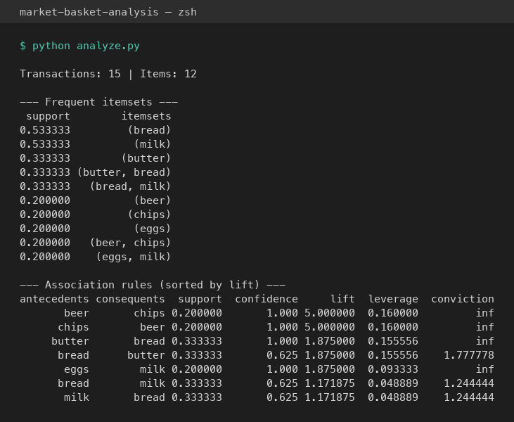
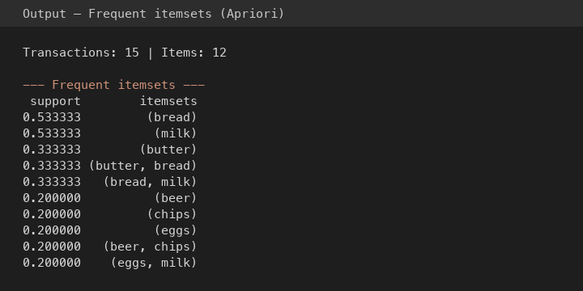
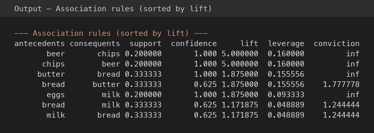

# Market basket analysis

Python project for **frequent itemsets** (Apriori) and **association rules** on retail-style transaction data, using [pandas](https://pandas.pydata.org/) and [mlxtend](https://rasbt.github.io/mlxtend/).

## Setup

```bash
cd market-basket-analysis
python3 -m venv .venv
source .venv/bin/activate   # Windows: .venv\Scripts\activate
pip install -r requirements.txt
```

## Run

```bash
python analyze.py
```

With your own CSV and thresholds:

```bash
python analyze.py --csv path/to/transactions.csv --min-support 0.15 --min-confidence 0.5 --min-lift 1.0
```

## Output (screenshots)

The following captures match a run on `data/sample_transactions.csv` with default thresholds. Plain text for the same run is also saved in [`docs/sample_output.txt`](docs/sample_output.txt) for reports or plagiarism checks.

**Full terminal output**



**Frequent itemsets (Apriori)**



**Association rules (sorted by lift)**



*If you change the CSV or thresholds, run `python analyze.py` again and replace the images by capturing your new output (Terminal screenshot), or update `docs/sample_output.txt` and regenerate the figures.*

## Data format

CSV with two columns:

| Column           | Description                          |
|------------------|--------------------------------------|
| `transaction_id` | Basket / order identifier            |
| `item`           | One product per row (repeat id for multiple lines in the same basket) |

Example: `data/sample_transactions.csv`.

## Git

Initialize a repository in this folder when you are ready:

```bash
git init
git add .
git commit -m "Initial commit: market basket analysis"
```

`.gitignore` already excludes `.venv/` and common Python artifacts.
